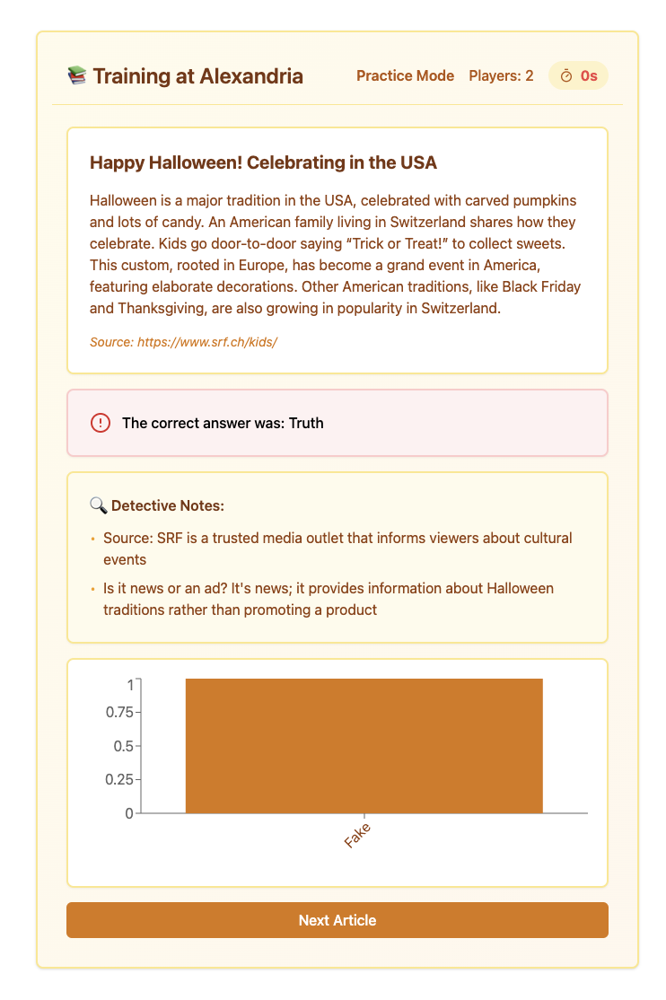

# Ladybugs---HerHack 
This app is going to gameify media literacy for children in classroooms. They will learn principles that will help them discern whether or not a news article is real or fake, which will let them accumulate points to win the game later on. 

This app will be called Fireproof Facts





## How to play

### Instructions
1. **Select Your Role:** Choose if you are a Teacher or a Student
2. (for Students) **Create Your Profile:**
Choose a Username: Pick any name you like!
Select an Avatar: Choose from the available options
3. **Phase 1: True or Fake?**
Review a news article and decide if it is True or Fake.
Once everyone answers or time runs out, see the class results: percentage of True vs. Fake answers.
Discuss the correct answer and learn why it was true or fake.
4. **Phase 2: Deeper Analysis**
Analyze more news articles and decide among the available options, e.g.:
True
Fake: All Caps Title
Fake: Emotional Language
Fake: Unreliable Source
After each question, view the combined class results: percentage correct vs. incorrect.
5. **Help Hypatia Save the Library:**
If over 50% of the class answers correctly, Hypatia throws water on the fire, making it smaller.
If over 50% answer incorrectly, fake news are thrown into the fire, making it bigger.
**Join the adventure and help Hypatia protect the Library of Alexandria while learning about media literacy!**


# Setup Instructions

1. Create a new Vite project with React and TypeScript:
```bash
npm create vite@latest . -- --template react-ts
npm install
```

2. Install Tailwind CSS and its dependencies:
```bash
npm install -D tailwindcss postcss autoprefixer
npx tailwindcss init -p
```

3. Install additional dependencies (recharts added post first implementation):
```bash
npm install lucide-react
npm install recharts 
```

4. Run the app:
in the root directory
```bash
npm run dev
```

at the server
```bash
npm start
```

## Project Structure

```
Ladybugs---HerHack/
├── src/                # Frontend code
│   └── components/
│   │   ├── ui/
│   │   │   └── # ui helpers
│   │   │
│       └── FakeNewsGame.tsx
|
├── server/                # Backend code
│   ├── src/
│   │   ├── # server helpers
│   │   └── server.ts
│   │
│   ├── package.json
│   └── tsconfig.json
|
├── shared/
│   └── types/
│       └── index.ts
├── package.json
├── tailwind.config.js
├── tsconfig.json
└── vite.config.ts
```
